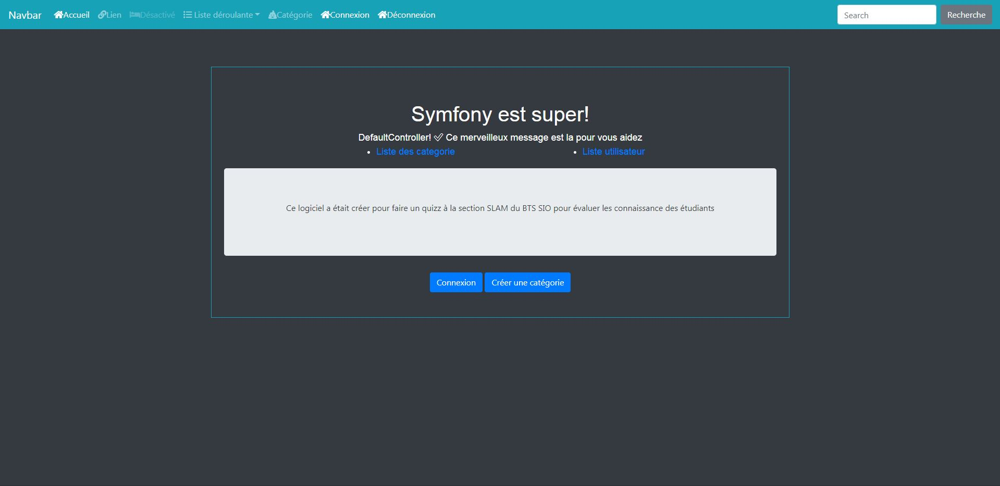

#Installation du logiciel

1. Le téléchargement
    *Pour commencer rendez vous sur ce lien : https://github.com/Norime/SlamQuiz*
    *Télécharger l'archive et décompresser la dans votre fichier*

2. La mise en service
    *Soyez sûr de disposer de la version php 7.0 minimum ainsi que d'avoir installer composer et symfony

3. La configuration

4. Manuel d'utilisation

*N'oublier pas d'effectuer la traduction avec la balise *
__également important__
`
Hello DefaultController!
`

*N'oublier pas de faire la command suivant dans le cmd afin d'actualiser les traductions disponible*
*php bin/console translation:update --force fr*